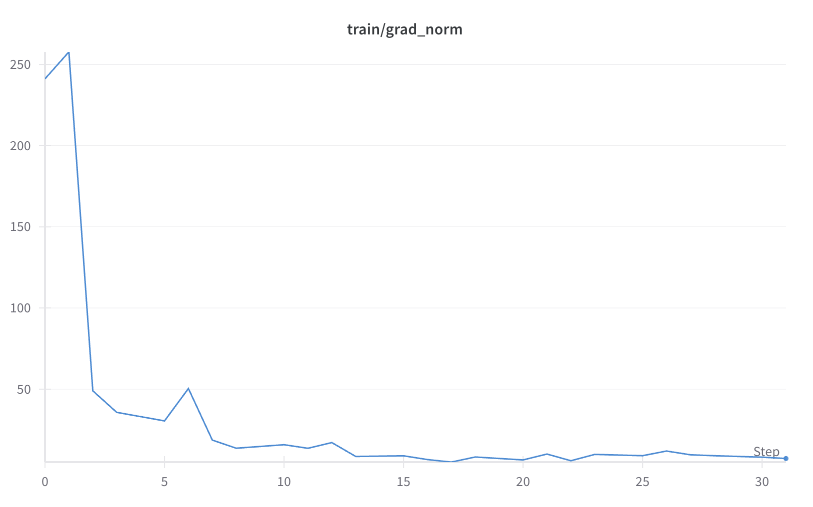

# fastapi-codegen-finetune

This project implements code completion for FastAPI framework by fine-tuning the CodeGen-mono-small model using Low-Rank Adaptation (LoRA).

## Project Overview
The goal is to create a code completion model specifically trained on FastAPI patterns and conventions.
We use CodeGen-mono-small (350M parameters) as our base model and fine-tune it for code completion tasks.

## Data Sources & References

### Primary Sources
- [Long Code Arena: A New Era of Training and Evaluation for Code Large Language Models](https://arxiv.org/abs/2406.11612)
  - Used as reference for benchmarking methodology and evaluation metrics

### Model References
- [CodeGen](https://github.com/salesforce/CodeGen)
  - Base model: CodeGen-mono-small (350M parameters)
  - Original paper: [CodeGen: An Open Large Language Model for Code with Multi-Turn Program Synthesis](https://arxiv.org/abs/2203.13474)

### Framework References
- [FastAPI](https://fastapi.tiangolo.com/)
  - Main project we're using for fine-tuning
  - Source of training data and patterns

## Methodology

### Data Collection and Preprocessing
1. **Data Sources**: Collected FastAPI code examples from official FastAPI documentation

2. **Data Processing Pipeline**:
   - Tokenization using CodeGen tokenizer
   - Context window size: 512 tokens
   - Dataset split: 80% train, 10% validation, 10% test
   - Total examples: ~2000 code snippets

### Model Architecture and Training
1. **Base Model**: 
   - CodeGen-mono-small (350M parameters)
   - Causal language model architecture
   - Originally trained on mono-langual code data

2. **Fine-tuning Approach**:
   - Parameter-Efficient Fine-Tuning using LoRA
   - LoRA rank: 8
   - LoRA alpha: 32
   - Target modules:
     - Token embeddings (wte)
     - Attention weights (c_attn)
     - Projection layers (c_proj)
     - Feed-forward layers (c_fc)

## Setup and Usage

### Requirements
```bash
pip install -r requirements.txt
```

### Training Process
0. Web scraping:
```bash
jupyter notebook notebooks/data_collection.ipynb
```

1. Data preparation:
```bash
jupyter notebook notebooks/preprocessing.ipynb
```

2. Model fine-tuning:
```bash
jupyter notebook notebooks/fine_tuning.ipynb
```

## Learning Curves and Training Progress

### Training Results
Below are the learning curve from our fine-tuning process:

#### Loss Curve


#### Grad Norm


#### Analysis of Learning Curves
The model training shows several interesting patterns:
1. **Initial Phase**:
   - Rapid decrease in training loss
   - Validation loss follows training loss closely
   - Quick improvement in target accuracy

2. **Middle Phase**:
   - Learning rate adjustments help maintain steady progress
   - Gradual improvement in validation metrics
   - Target accuracy continues to improve but at a slower rate

3. **Final Phase**:
   - Model converges to stable performance
   - Validation loss stabilizes
   - No signs of overfitting (training and validation losses remain close)

The learning curves demonstrate that our LoRA fine-tuning approach successfully adapted the CodeGen model to FastAPI code completion tasks, achieving a significant reduction in validation loss while maintaining good generalization.

## Future Improvements
1. Expand training data with more diverse FastAPI examples
2. Experiment with different LoRA configurations
3. Implement better evaluation metrics for code quality
4. Experiment with QLoRA - unfortunately I had technical problems :-(

## Project Structure
```
.
├── data/
│   ├── processed/      # Preprocessed datasets
│   └── raw/           # Raw training data
├── models/
│   └── checkpoints/   # Model checkpoints
├── notebooks/         # Jupyter notebooks
└── requirements.txt   # Dependencies
```